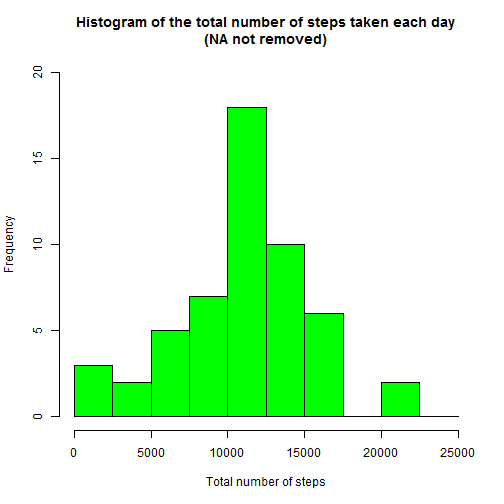
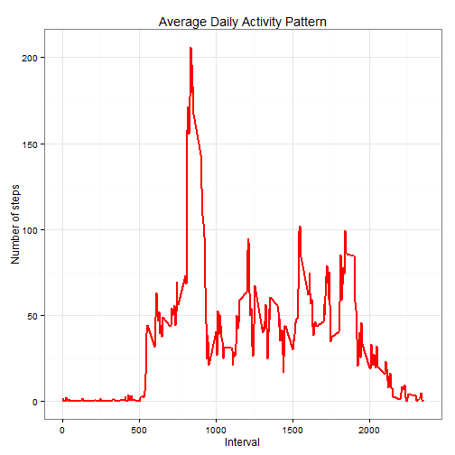
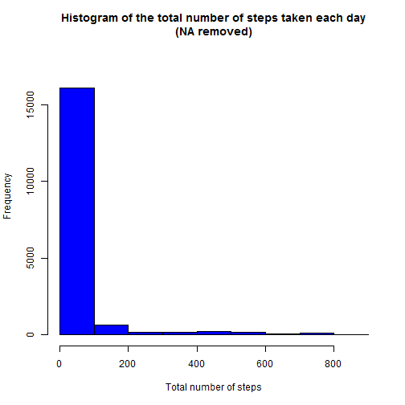
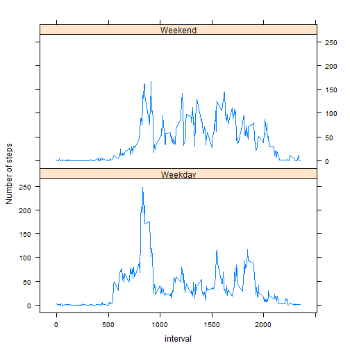

## Loading and preprocessing the data

```r
library(ggplot2)
library(knitr)
file2<-"~/2015/051315 MSC Myprocert/Bahan Study/Module 5 Reproducible/Assignment/RepData_PeerAssessment1/activity.csv"
activityData <- read.csv(file2,header = TRUE, sep = ",")
head(activityData)
```

```
##   steps       date interval
## 1    NA 2012-10-01        0
## 2    NA 2012-10-01        5
## 3    NA 2012-10-01       10
## 4    NA 2012-10-01       15
## 5    NA 2012-10-01       20
## 6    NA 2012-10-01       25
```


## What is mean total number of steps taken per day?
1. Calculate the total number of steps taken per day

```r
TotalStep<-aggregate(activityData$steps, by=list(activityData$date), FUN=sum)[1:2]
colnames(TotalStep) <- c("date","totalsteps")
head(TotalStep)
```

```
##         date totalsteps
## 1 2012-10-01         NA
## 2 2012-10-02        126
## 3 2012-10-03      11352
## 4 2012-10-04      12116
## 5 2012-10-05      13294
## 6 2012-10-06      15420
```

2. Make a histogram of the total number of steps taken each day

```r
hist(TotalStep$totalsteps, 
     breaks=seq(from=0, to=25000, by=2500),
     col="green", 
     xlab="Total number of steps", 
     ylim=c(0, 20), 
     main="Histogram of the total number of steps taken each day\n(NA not removed)")
```

 

3. Calculate and report the mean and median of the total number of steps taken per day

```r
#count mean per date
MeanStep<-aggregate(activityData$steps, by=list(activityData$date), FUN=mean)[1:2]
colnames(MeanStep) <- c("date","steps")
head(MeanStep)
```

```
##         date    steps
## 1 2012-10-01       NA
## 2 2012-10-02  0.43750
## 3 2012-10-03 39.41667
## 4 2012-10-04 42.06944
## 5 2012-10-05 46.15972
## 6 2012-10-06 53.54167
```

```r
#count median per date
MedianStep<-aggregate(activityData$steps, by=list(activityData$date), na.rm=TRUE, FUN=median)[1:2]
colnames(MedianStep) <- c("date","steps")
head(MedianStep)
```

```
##         date steps
## 1 2012-10-01    NA
## 2 2012-10-02     0
## 3 2012-10-03     0
## 4 2012-10-04     0
## 5 2012-10-05     0
## 6 2012-10-06     0
```


## What is the average daily activity pattern?
1.Make a time series plot (i.e. type = "l") of the 5-minute interval (x-axis) and the average number of steps taken, averaged across all days (y-axis)

```r
#first calculate average steps per interval
dailyaverage2<-aggregate(steps ~ interval, activityData, mean)
ggplot(dailyaverage2, aes(x=interval, y=steps)) +   
  geom_line(color="red", size=1) +  
  labs(title="Average Daily Activity Pattern", x="Interval", y="Number of steps") +  
  theme_bw()
```

 

2.Which 5-minute interval, on average across all the days in the dataset, contains the maximum number of steps?

```r
max_interval <- dailyaverage2[which.max(  
  dailyaverage2$steps),]
max_interval
```

```
##     interval    steps
## 104      835 206.1698
```


## Imputing missing values
1.Total number of missing values in the dataset

```r
sum(is.na(activityData$steps))
```

```
## [1] 2304
```

2.Devise a strategy for filling in all of the missing values in the dataset. The strategy does not need to be sophisticated. For example, you could use the mean/median for that day, or the mean for that 5-minute interval, etc.
Create a new dataset that is equal to the original dataset but with the missing data filled in.

```r
data_full <- activityData #create new data set
nas <- is.na(data_full$steps)#number of NAs in new dataset
avg_interval <- tapply(data_full$steps, data_full$interval, mean, na.rm=TRUE, simplify=TRUE)
#returns mean of Steps by Hours while ignoring Nas as a vector
data_full$steps[nas] <- avg_interval[as.character(data_full$interval[nas])]
#assign values of steps according to hour-slice
sum(is.na(data_full$steps))#check for no of Nas in new dataset
```

```
## [1] 0
```

3.Make a histogram of the total number of steps taken each day and Calculate and report the mean and median total number of steps taken per day. Do these values differ from the estimates from the first part of the assignment? What is the impact of imputing missing data on the estimates of the total daily number of steps?

```r
hist(data_full$steps, 
     breaks=seq(from=0, to=900, by=100),
     col="blue", 
     xlab="Total number of steps", 
     ylim=c(0, 18000), 
     main="Histogram of the total number of steps taken each day\n(NA removed)")
```

 


## Are there differences in activity patterns between weekdays and weekends?
1.Create a new factor variable in the dataset with two levels - "weekday" and "weekend" indicating whether a given date is a weekday or weekend day.

```r
sum(is.na(data_full$steps))#check for no of Nas in new dataset
```

```
## [1] 0
```

```r
#copy a new factor column from the date column
data_full$Day <- factor(weekdays(as.Date(data_full$date)))
data_full$DayType <- factor(weekdays(as.Date(data_full$date)))
levels(data_full$DayType) <- list(
  Weekday= c("Monday", "Tueday","Wednesday","Thursday","Friday"),
  Weekend = c("Saturday", "Sunday")#rename DayType to either weekend or weekday
)
head(data_full)
```

```
##       steps       date interval    Day DayType
## 1 1.7169811 2012-10-01        0 Monday Weekday
## 2 0.3396226 2012-10-01        5 Monday Weekday
## 3 0.1320755 2012-10-01       10 Monday Weekday
## 4 0.1509434 2012-10-01       15 Monday Weekday
## 5 0.0754717 2012-10-01       20 Monday Weekday
## 6 2.0943396 2012-10-01       25 Monday Weekday
```

2.Make a panel plot containing a time series plot (i.e. type = "l") of the 5-minute interval (x-axis) and the average number of steps taken, averaged across all weekday days or weekend days (y-axis). 

```r
library("lattice")
dayTypeIntervalSteps <- aggregate(
  data=data_full,
  steps ~ DayType + interval,
  FUN=mean
)
xyplot(
  type="l",
  data=dayTypeIntervalSteps,
  steps ~ interval | DayType,
  xlab="interval",
  ylab="Number of steps",
  layout=c(1,2)
)
```

 

